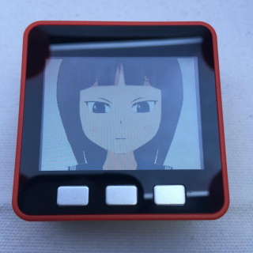
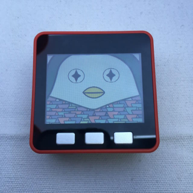

# M5Stack-Image-Avatar(beta version)
 M5Stack Image Avatar(beta version)




[日本語](README.md) | English

The English version of README_en.md was created using [DeepL](https://www.deepl.com/translator). Please point out any errors in the translation.

# Beta Notes.

　The M5Stack Image Avatar requires [LovyanGFX library](https://github.com/lovyan03/LovyanGFX) because it uses the scaling and rotating functions of Sprite. (The M5Stack library does not have a scaling feature.) It's still in development, so it could cause some kind of failure. Also, major specification changes may be made, and if the version is not compatible with LovyanGFX, it may not work. Thank you for your understanding in advance.

As of April 2020, button events must be implemented using digitalRead as they cannot be used simultaneously with M5Stack's library. (It can be co-located with [ESP32-Chimera-Core](https://github.com/lovyan03/ESP32-Chimera-Core), which is tentatively the same functionality as the M5Stack library.)

# Overview

　The application that can create Avatar by combining the image files (BMP) prepared in advance. You can also combine it with [AquesTalk for ESP32](https://www.a-quest.com/products/aquestalk_esp32.html) to speak the words.

# Environment
- ArduinoIDE 1.8.10(or 1.8.12)

# Requirement
- [LovyanGFX](https://github.com/lovyan03/LovyanGFX)
- [M5StackSDUpdater](https://github.com/tobozo/M5Stack-SD-Updater)
## Installing AquesTalk
Follow [AquesTalk for ESP32](https://www.a-quest.com/products/aquestalk_esp32.html) to install it. <br>
If you have difficulty installing AquesTalk, please comment out the #define USE_TTS at the beginning of M5StackImageAvatar.ino. <br>

# Supported models
- M5Stack Basic,Gray,Fire,Go

## Notice
Using a 320x240 8bit color(256Color) image file consumes a lot of memory, so if you run out of memory, please use M5Stack Fire or reduce the color to 4bit color.

# Usage
Create a folder called "bmp" in the root of your SD card and put the files in the bmp folder.
Copy the M5StackImageAvatar folder to your sketch folder and build it.

- Button A: Avatar will move.
- Button B: The eyeballs move to the left and right.
- Button C: Emotions change.

## Avatar model
There are two types in the example folder, [Homura Gotsumi](example/homura_gotsumi) and [amabie](example/amabie), so please refer to them.


# Image Preparation
You will need seven Avatar parts to enrich your expression.

## Points to note when creating an image part
In order to create the original ImageAvatar, a component BMP image file is required.

## Tools used to create images
- [ComiPo!](https://www.comipo.com/)<br>I used it to create the original data of Homura Gotsumi.
- [Adobe Illustrator and Photoshop](https://www.adobe.com/)<br>I used it for color reduction and conversion of images and cropping of parts.
- [GIMP](https://www.gimp.org/)<br>I used it for exporting palette information.

### Transparent colors and skin tones
In order to use the overlapping parts, the transparent color, the skin color and the color of the eyeball are decided in advance.

In the case of Homura Goshoku, it is transparent (0x00FF00U), skin color (0xFFE9DBU), and eyeball color (0xFFFFFFU).
In the case of Amabie, it is a transparent color(0x00FF00U), skin color(0xFFFFFFU) ,eyeball color(0xFFFFFFU)

### Margin for rotation.
If you use the Moe axis, you need the margin of Sprite, so the original image should be a size that can be tilted.

Check it out with a sample.
Homura Gotsumi is made in LCD size (320x240) and may be partially chipped when tilted. Amabie makes it in LCD size +20 (340x260), so it's not lacking.

## Necessary parts
- Fixed part 1 (Prepare one pattern)
1. head<br>(skin color for the face, transparent for the body parts)
1. neck and torso<br>(head and body are transparent)
- Fixed Part 2 (Prepare as many emotions as you want)
1. eyeballs<br>Paint all but the blackest eyes with the color of the eyeballs
1. prepare only the right eyebrows<br>.

- Parts that change state (I'll have as many open/close x emotions)
1. open eyelid<br> Prepare only the right eyelid. (Skin tone around the edges and clear in the eyelids.)
Prepare only the right side of the closed eyelid<br>. (skin tone all around.)
1. open mouth<br>The area around the mouth is skin tone
1. closed mouth<br>The area around the mouth is skin tone

The eyelids and mouth should be the same size, open and closed.

### If you want to express your feelings
If you want to express your emotions, you can switch between the fixed parts (head and body) by replacing the BMP file with other parts.

Homura Gotsumi can switch between normal, troubled, and angry by pressing button C.

## Unify the color palette information of image files
As of April 2020, each image should have a common color palette and be embedded. You can embed the common color palette (color profile, color map) information by using GIMP or Photoshop. 
** The basic color palette must be created from an image file with all colors, including transparent and skin tones. **
[colorpalette.png](png/colorpalette.png) for reference.

I plan to improve this specification so that only skin color is common and okay.

# Optional Features
There are three optional features, each of which can be toggled using #define in M5StackImageAvatar.ino. (Comment out if you don't need to.)

```
#define USE_TTS     // AquesTalk is necessary.(https://www.a-quest.com/products/aquestalk_esp32.html)
#define USE_MIC     // M5Go Bottom's MIC is necessary.
#define USE_WIFI    // M5StackFire is required when using 8bit color.Because Gray and Basic don't have enough memory.

```
- USE_TTS<br> Use speech synthesis. (Requires installation of AquesTalk for ESP32)
- USE_MIC<br>Lipsync to match the MIC attached to the go bottom.
- USE_WIFI<br>No special features are currently implemented just by connecting to it.

## Configuration file
- src/colorpalette.h<br>Set the color palette information for the image.
- src/avatarconfig.h<br>Set the Avatar parameters, position, size, angle, etc. of each image file.
- src/WiFiconfig.h<br>Set the SSID and passphrase to connect to WiFi. If not specified, it is connected to the previous connection destination of ESP32.

# Reference repositories
- [m5stack-avatar](https://github.com/meganetaaan/m5stack-avatar)
- [M5Stack_WebRadio_Avator](https://github.com/robo8080/M5Stack_WebRadio_Avator)
- [Sample for M5StackFire M5StackFire_MicrophoneSpectrumTFT](https://github.com/m5stack/M5Stack/tree/master/examples/Fire/M5StackFire_MicrophoneSpectrumTFT)

# Acknowledgements.
Thanks to [meganetaaan](https://github.com/meganetaaan) for creating and publishing [M5Stack-Avatar](https://github.com/meganetaaan/m5stack-avatar), which was the source of the movement and structure of this software.

Thanks to [lovyan03](https://github.com/lovyan03) of [LovyanGFX](https://github.com/lovyan03/LovyanGFX) for the excellent performance and features that make ImageAvatar a reality.

Thanks to [robo8080](https://github.com/robo8080) of [M5Stack_WebRadio_Avatar](https://github.com/robo8080/M5Stack_WebRadio_Avator) for giving me a lot of advice and referring to me in the early days of creating Homura Gotsumi.

# Credit
- [meganetaaan](https://github.com/meganetaaan)
- [lovyan03](https://github.com/lovyan03/LovyanGFX)
- [robo8080](https://github.com/robo8080)

# LICENSE
[MIT](LICENSE)

# Author
[Takao Akaki](https://github.com/mongonta0716)

